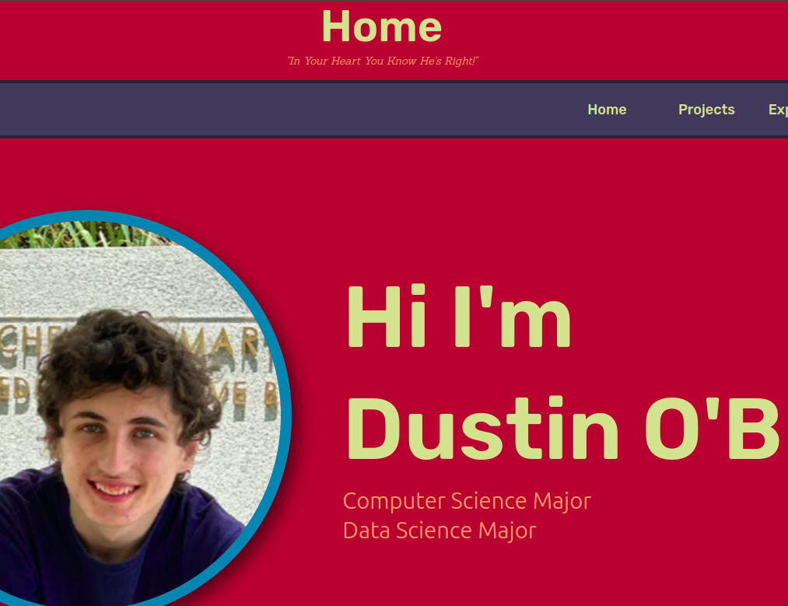

# Dustin's Portfolio Website

# Table of Contents

- [Table of Contents](#table-of-contents)
- [Description](#description)
- [Features](#features)
- [Tech Stack](#tech-stack)

# Description

This is my portfolio made in react it contains 5 pages including a home page, projects page, experience and more. The project is visually distinctive and original in design.

**Check it out at** [dustintobrien.com](https://dustintobrien.com/)

# Features

- Home Page
- Projects Page
- Experience Page
- Education Page
- About Me Page
- Email and Contacting feature

# Tech Stack

- React
- Javascript
- MUI
- Framer Motion
- Swiper
- CSS
- HTML
- Email JS

